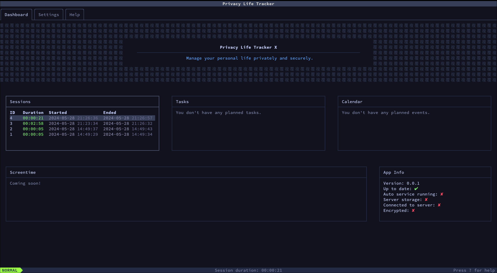

<!--
DON'T CONTRIBUTE TO THIS FILE!
This file is generated by `build.rs` from `docs/REPO_README.md`, which is the file to edit to change the README.
-->

[](https://crates.io/crates/pltx)
[](https://github.com/pltx/tui/actions)
[](https://github.com/pltx/tui/releases)
[](https://crates.io/crates/pltx)
[](https://www.rust-lang.org/)
[](/LICENSE)

**pltx** _(Privacy Life Tracker X)_ is a tool for tracking and managing your personal life in a private and secure manner.
**`pltx-tui`** is the default interface that provides this capability in the terminal!



## Features

- [See all the modules here](#modules).
- Vim-like keybinds for navigation and editing.
- Fully customizable profiles, colors, limits, and more.
- ~~Data is encrypted by default with a passphrase (coming soon).~~
- Data can be stored locally ~~or on a [server](https://github.com/pltx/server) (coming soon)~~.

## Documentation

- [Installation](#installation)
- [Usage](#usage)
- [Modules](#modules)
- [Configuration](#configuration)

## Installation

Whilst being in early development, pltx-tui can only be manually installed via cargo.

**Linux**

```sh
git clone https://github.com/pltx/tui
cargo install --path .
```

## Usage

1. Run `pltx` to start the application.
2. You will see the dashboard. Press `}` twice to go two tabs to the right.
3. These are the help pages. Move up with **`j`** and down with **`k`**. Select "navigation" and press **`<enter>`**.
4. Here you'll find all the information you need to navigate pltx.

These pages are generated from the README files in the `/docs` directory, so you can also [view them on GitHub](https://github.com/pltx/tui/blob/main/docs).

Press **`[`** to go back and **`:`** to open the command prompt where you can type **`q`** + **`<enter>`** to quit (quit should auto-complete). You can also use the help command to go to the help pages from anywhere in the application.

## Modules

- **[Home](./docs/home.md):** Includes the dashboard, settings, and help pages.
- **[Project Management](./docs/project-management.md):** Manage project or general tasks. Similar to Trello or GitHub projects.
- **More coming soon!**

## Configuration

You can edit the config in your platforms config directory:

| Platform | Location                                 | Default                                        |
| -------- | ---------------------------------------- | ---------------------------------------------- |
| Linux    | `$XDG_CONFIG_HOME/.config/pltx`          | `/home/user/.config/pltx/config.toml`          |
| macOS    | `$HOME/Library/Application Support/pltx` | `/Users/User/Library/Application Support/pltx` |
| Windows  | `{FOLDERID_RoamingAppData}/pltx`         | `C:\Users\User\AppData\Roaming\pltx`           |

```toml
# The file is located in `docs/config.toml`.

# Controls the log level that outputs to the log file.
# Available options: debug, info, warn, error
log_level = "info"
# This should be set to the name of a profile.
default_profile = "default"

[colors]
# The default color preset. Defined colors will still override the preset colors.
preset = "default"
fg = "#c0caf5"
secondary_fg = "#7f87ac"
tertiary_fg = "#2c344d"
highlight_fg = "#61a4ff"
bg = "#11121D"
primary = "#9556f7"
success = "#85f67a"
warning = "#ff9382"
danger = "#ff4d66"
date_fg = "#9293b8"
time_fg = "#717299"
input_fg = "#c0caf5"
input_bg = "#232b44"
input_focus_fg = "#c0caf5"
input_focus_bg = "#2c344d"
input_cursor_fg = "#000000"
input_cursor_bg = "#7f87ac"
input_cursor_insert_fg = "#000000"
input_cursor_insert_bg = "#c0caf5"
active_fg = "#373f58"
active_bg = "#61a4ff"
border = "#373f58"
border_active = "#7f87ac"
border_insert = "#61a4ff"
popup_bg = "#161728"
popup_border = "#373f58"
keybind_key = "#A485DD"
keybind_fg = "#6698FF"
title_bar_bg = "#373f58"
title_bar_fg = "#CCCCCC"
tab_fg = "#7f87ac"
tab_active_fg = "#c0caf5"
tab_border = "#373f58"
status_bar_bg = "#232b44"
status_bar_fg = "#7f87ac"
status_bar_normal_mode_bg = "#9bff46"
status_bar_normal_mode_fg = "#232b44"
status_bar_insert_mode_bg = "#61a4ff"
status_bar_insert_mode_fg = "#232b44"
status_bar_interactive_mode_bg = "#ffff32"
status_bar_interactive_mode_fg = "#232b44"
status_bar_delete_mode_bg = "#ff6069"
status_bar_delete_mode_fg = "#232b44"

[modules.home]
dashboard_title = "Privacy Life Tracker X"
dashboard_message = "Manage your personal life privately and securely."

[modules.project_management]
# The maximum number of lists allowed in a project.
max_lists = 5
# Days before the due date that a card should be considered due soon.
due_soon_days = 3
completed_char = "✅"
overdue_char = "🚫"
due_soon_char = "⏰"
in_progress_char = "🌐"
important_char = "⭐"
default_char = "  "

# Create a separate profile. The profiles shown below are included by default. You can override it by changing the values or create new ones entirely.
[[profiles]]
name = "default"
config_file = "config.toml"
db_file = "data.db"
log_file = "debug.log"

[[profiles]]
name = "dev"
config_file = "dev.toml"
db_file = "dev.db"
log_file = "dev.log"

```

## Contributing

All contributions to the project are welcome! Please read the [Contributing Guidelines](/CONTRIBUTING.md) for more details.

## License

This project is licensed under the [GPL-3.0](./LICENSE) license.

## Similar Projects

- [`kdheepak/taskwarrior-tui`](https://github.com/kdheepak/taskwarrior-tui) (project management)
- [`PlankCipher/kabmat`](https://github.com/PlankCipher/kabmat) (project management)
- [`Zaloog/kanban-python`](https://github.com/Zaloog/kanban-python) (project management)
- [`topydo/topydo`](https://github.com/topydo/topydo) (project management)

